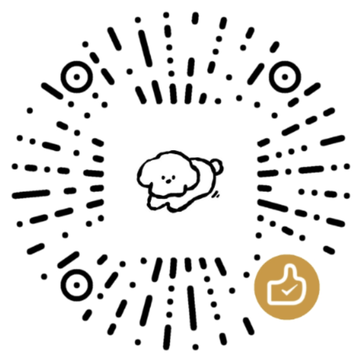

<p align="center" style="margin-bottom:10px">
    
</p>

<p align="center">
  <a
    href="https://chromewebstore.google.com/detail/%E9%A2%88%E6%A4%8E%E4%BF%9D%E6%8A%A4%E5%99%A8/onieefmkohombbhkiifofjlpfjaomimo"
    ></a>
</p>

# 颈椎保护器

颈椎保护器：一款守护颈椎健康的 Chrome 插件。

## 功能介绍

### 💪功能亮点

✔️多样化颈椎倾斜模式，助力健康护颈
✔️实时显示当前时间和下一个休息日，科学安排休息
✔️回顾历史上的今天，了解重要历史事件
✔️精选经典古诗词，传承中华文化瑰宝
✔️每日英语单词及发音，轻松提升语言能力
✔️同步主流社交平台热搜，紧跟热门趋势
✔️支持多主题切换，满足不同视觉需求
✔️每日名人名言激励，启发思考与动力
✔️结合传统文化，支持农历、节气、每日宜忌等

### 👉 主题模式

✔️亮色：明亮清晰，适合日间使用
✔️暗黑：低光环境下护眼体验
✔️系统：自动匹配系统亮暗主题，智能适配（默认）

### 👉 颈椎倾斜模式

✔️普通模式：轻微角度倾斜，舒适自然
✔️训练模式：小角度倾斜，5 秒间隔自动切换角度（默认）
✔️强化模式：大角度倾斜，中心内容旋转180°，5 秒间隔自动切换角度
✔️高级模式：支持用户自定义最大倾斜角度及切换时间，中心内容旋转180°

### 👉 内容分类

✔️诗词：每日更新 10 篇诗词古文，存储近 30 天诗词记录，随机展示 2 首
✔️历史：展示“历史上的今天”重要事件、当天假日与习俗（默认）
✔️英语：每日推送 15 个新单词，支持近 30 天词库，随机展示 5 个
✔️热榜：整合多个平台热搜新闻，支持每 5 分钟更新

### 👉 百科数据源（可设置优先级）

插件支持以下数据源，出现异常时自动切换备选：

✔️百度百科
✔️维基百科（默认）

## 开发

1. 安装依赖

```bash
pnpm install
```

2. 开发模式

```bash
# pnpm run dev
pnpm run build
# 上传 dist目录到chrome extension
```

3. 构建上传

```bash
# pnpm run build:prod
pnpm run release:extension
```

## 鸣谢

本插件使用了以下资源：

1. Logo与部分图标为 [小羊快跑ya](https://www.iconfont.cn/user/detail?uid=6930945&nid=JPSbnJbK5Uuz)发布在[iconfont](https://www.iconfont.cn/collections/detail?cid=40379)的资源
2. 假期数据使用了[timer](https://timor.tech/)的[免费节假日 API](https://timor.tech/api/holiday)
3. 历史上的今日数据来自于[wikipedia](https://zh.m.wikipedia.org/zh-cn/%E5%8E%86%E5%8F%B2%E4%B8%8A%E7%9A%84%E4%BB%8A%E5%A4%A9)和[百度百科](https://baike.baidu.com/item/4%E6%9C%8828%E6%97%A5)
4. 古诗词数据来源于githun开源古诗词项目[chinese-poetry](https://github.com/chinese-poetry/chinese-poetry)
5. 名人名言数据源是 [ZenQuotes](https://zenquotes.io/) 和 [一言](https://v1.hitokoto.cn/?c=i)
6. 英语单词使用[google-10000-english](https://github.com/first20hours/google-10000-english)的no-swears高频单词
7. 热榜消息来自于[Google New](https://news.google.com/home?hl=zh-CN&gl=CN&ceid=CN:zh-Hans)、[头条热搜](https://so.toutiao.com/search/?keyword=%E7%83%AD%E6%A6%9C&pd=synthesis&source=input&traffic_source=&original_source=&in_tfs=&in_ogs=)、[微博热搜](https://s.weibo.com/top/summary?cate=realtimehot)、[小红书推荐](https://www.xiaohongshu.com/explore?channel_id=homefeed_recommend)、[知乎热榜](https://www.zhihu.com/billboard)、[bilibili](https://www.bilibili.com/v/popular/all)、[36氪](https://36kr.com/newsflashes/catalog/0)、[百度热搜](https://top.baidu.com/board?tab=realtime)、[百度贴吧](https://tieba.baidu.com/hottopic/browse/topicList?res_type=1)和[v2ex](http://v2ex.com/)等
8. 项目功能参考[wai](https://github.com/dukeluo/wai)
9. 使用开源日历工具库[Tyme](https://6tail.cn/tyme.html)，获取农历、干支、生肖、节气、法定假日，宜忌等

## 反馈

👉 [issue区](https://github.com/maginapp/neck-upgrade/issues) | [讨论区](https://github.com/maginapp/neck-upgrade/discussions) | [chrome应用商店](https://chromewebstore.google.com/detail/%E9%A2%88%E6%A4%8E%E4%BF%9D%E6%8A%A4%E5%99%A8/onieefmkohombbhkiifofjlpfjaomimo)

## 赞赏

<div align="center" style="margin-bottom:20px">
    
</div>
