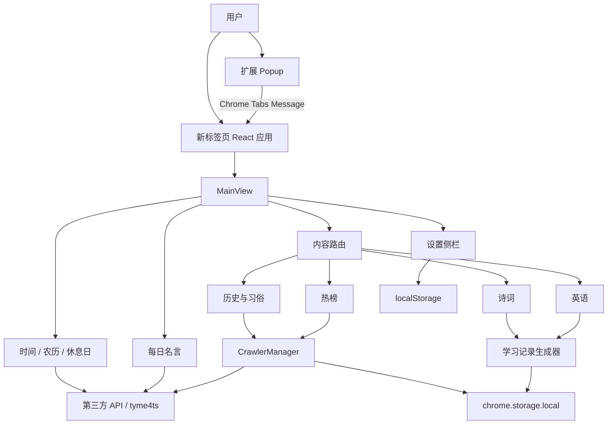

# 颈椎保护器研发设计文档

> 文档基线：代码版本 1.2.5 ｜ 梳理日期：2026-08-10 ｜ 依据：当前仓库实际实现

## 1. 项目概述

颈椎保护器（neck-upgrade）是一款基于 Chrome Manifest V3 的新标签页扩展。它通过定时旋转核心内容区域，引导用户改变观看角度，同时在新标签页聚合日期、农历、休息日、历史、诗词、英语、热榜和名言等信息。

项目是纯前端扩展，无自建服务端。运行期数据来自扩展内置静态资源、第三方公开 API 和网页抓取结果，用户设置及业务缓存保存在浏览器本地。

## 2. 技术栈与工程约束

| 类别         | 选型                                                        |
| ------------ | ----------------------------------------------------------- |
| UI           | React 18、React DOM、SCSS Modules                           |
| 语言         | TypeScript 5.3，严格模式                                    |
| 构建         | Vite 5、Rollup、vite-plugin-svgr                            |
| 扩展规范     | Chrome Extension Manifest V3                                |
| 日期文化数据 | tyme4ts                                                     |
| 数据处理     | lodash-es、opencc、原生 DOMParser/Fetch                     |
| 测试         | Vitest（当前仅有少量诗词工具测试）                          |
| 包管理       | pnpm 9，Node.js ≥ 20                                        |
| 质量工具     | ESLint、Stylelint、Prettier、Husky、lint-staged、Commitlint |

关键命令：

```bash
pnpm install
pnpm run dev
pnpm run build
pnpm run build:prod
pnpm run test
pnpm run lint:es
pnpm run lint:style
pnpm run release:extension
```

`build:prod` 会设置 `REMOVE_CONSOLE=true`，由 Vite 插件移除部分 `console.log`；`release:extension` 负责生产构建、压缩包和 Git 标签准备。

## 3. 总体架构



### 3.1 运行入口

- `src/extension/pages/newtab/`：替换 `chrome://newtab` 的主应用入口。
- `src/extension/pages/popup/`：点击扩展图标后的管理入口。
- `src/extension/background/index.ts`：Manifest V3 service worker；目前仅保留消息监听骨架，没有实际业务处理。
- `src/extension/content/index.ts`：内容脚本占位文件，未加入构建入口，也未在 manifest 注册。

### 3.2 分层职责

| 层           | 目录                  | 职责                                         |
| ------------ | --------------------- | -------------------------------------------- |
| 页面入口     | `src/extension/pages` | React 挂载、页面级组合                       |
| 展示组件     | `src/components`      | 主视图、内容卡片、设置、Popup、主题          |
| 业务工具     | `src/utils`           | 抓取、格式化、学习记录、缓存、并发和日期计算 |
| 领域类型     | `src/types`           | 设置、知识、新闻、诗词、词典等类型定义       |
| 常量配置     | `src/constants`       | API、缓存键、数量、模式和标签配置            |
| 静态数据     | `public/data`         | 诗词库、高频英语词表                         |
| 数据生产脚本 | `scripts`             | 诗词抓取处理、图片处理、发布打包             |

## 4. 核心模块设计

### 4.1 新标签页与视图布局

`App` 通过 `useSettings` 获取设置与当前实际主题，再组合 `ThemeContainer`、`MainView` 和 `Settings`。`MainView` 分为：

- Header：时间、公历日期、农历、节气、宜忌、下个休息日；
- Aside：随机名言；
- Content：按设置切换历史、诗词、英语、热榜；
- 外层 Settings：设置按钮、侧边栏及遮罩。

当窗口宽或高小于 900px 时，代码写入 CSS 变量 `--scale-main-view-ratio`，核心视图按比例缩放。

### 4.2 颈椎旋转模式

普通、训练、强化和自定义模式的旋转作用于整个 `MainView` 核心内容，通过 `transform: rotate(...)` 实现。阅读模式将旋转目标缩小到主区域的名人名言，`MainView`、日期和其他界面不旋转。模式参数集中在 `MOD_CONFIG`：

| 模式   | 随机角度范围 | 默认切换间隔 | 说明                           |
| ------ | -----------: | -----------: | ------------------------------ |
| 普通   |      15°–60° |         0 秒 | 进入模式时旋转一次，不自动切换 |
| 训练   |      15°–60° |         5 秒 | 定时随机切换角度               |
| 阅读   |      15°–60° |         5 秒 | 主区域显示名言，仅旋转名言容器 |
| 强化   |     80°–180° |         5 秒 | 大角度定时切换                 |
| 自定义 |  0°–用户上限 |     用户设置 | 间隔 0–60 秒，最大角度 0–360°  |

随机角度由 `getRandomNumber` 生成，并参考当前角度以减少连续相同方向。模式组件内部维护定时器，设置改变后重新创建。

### 4.3 设置与主题

设置模型包含：`theme`、`neck`、`dataType`、`knowledge`、`poetry`。`poetry` 保存诗词一级分类和二级来源多选结果。默认值为系统主题、训练模式、历史内容、维基百科优先和全部诗词来源。设置初始化时会与默认结构合并，以兼容缺少新增字段的旧设置。

设置使用 `LocalManager` 写入页面 `localStorage`，`SettingsStorage.isExpired` 被重写为永不过期。系统主题通过 `prefers-color-scheme` 监听，用户选择 `system` 时随操作系统变化。

### 4.4 历史上的今天

历史模块为维基百科和百度百科分别建立抓取管理器。处理流程为：

1. 按当天日期拼接目标页面；
2. 拉取 HTML 并解析事件、节假日与习俗；
3. 保存至 `chrome.storage.local`，默认按自然日失效；
4. 从分类中抽取最多 8 条事件、随机抽取最多 2 条习俗；
5. 首选源失败或结果为空时自动切换备用源。

组件用 `dangerouslySetInnerHTML` 渲染抓取后的 HTML，安全性依赖格式化层对内容的控制。

### 4.5 诗词学习

诗词来自扩展内置的 `public/data/poetry.json`。数据使用 `category` 表示诗歌、词、经典、蒙学和文人小品等一级分类，使用 `sources` 数组保留一个作品的一个或多个实际语料来源。用户可以先选一级分类，再多选二级来源。每天从匹配范围且尚未进入对应历史记录的内容中随机选择 10 条，每次页面展示 2 条；历史记录最多保留 30 天。不同来源组合使用独立缓存作用域，切换来源不会继续消费原来源队列。记录身份由“标题 + 作者 + 正文行数 + 首行/中间行/末行各自前三个非空字符”共同确定，避免《增广贤文》等同标题、同作者分段被错误地视为同一条。未学习候选不足一天数量时，生成器会先使用剩余候选，再从新一轮数据补齐；旧版本遗留的空队列也会自动重新生成。

数据更新脚本位于 `scripts/fetch-poetry/`，负责从 `chinese-poetry` 数据源下载、清洗、分段和生成最终静态 JSON。《千字文》以相邻两个四字句为不可拆分的韵律单元，再按“天地人文与王道、修身家庭与处世、都邑制度历史与山河、农事退隐与日常生活”四大篇章细分为 34 个语义小节。每个小节生成一条蒙学记录，标题使用小节名称，篇章和小节名称写入标签，并保留与正文逐行对应的原始拼音；展示层通过 `getPoetryDisplayLines` 将相邻两个四字句及其拼音合并为一行，不修改底层学习数据。

### 4.6 英语学习

单词基础列表来自内置的 Google 10000 高频词表。每天选择 15 个新词，每批展示 5 个，并以最大并发 3 调用 Dictionary API 获取音标、音频、词性和释义。展示前会对 meanings 和 definitions 随机裁剪，控制信息密度。

若词典请求失败，仍保留单词本身，不阻塞整批展示。

### 4.7 热榜聚合

热榜由 `NewsType`、`NEWS_GROUP_LABELS` 和 `newsManagerMap` 三部分驱动：枚举定义类型，标签配置控制 UI 分组，映射表绑定具体抓取管理器。

已接入 9 个平台分组：微博、小红书、今日头条、知乎、Bilibili、Google 新闻、百度、36氪、V2EX，共 47 个细分类。默认显示今日头条热搜。

统一流程：请求站点 → 解析为 `NewsItem[]` → 缓存 → 分页显示。缓存有效期 5 分钟，空结果或登录提示不会作为有效缓存。每页默认 10 条，“刷新”实质为请求下一页，超出末页后回到第一页。部分需要登录的数据源返回登录链接。

### 4.8 时间、农历与休息日

- 时钟每秒刷新；日期变化时重新计算农历并请求休息日。
- `tyme4ts` 在本地计算农历日期、干支生肖、节气、节日、宜忌、彭祖百忌、梅雨和儒略日。
- 下个休息日调用 Timor API，并以自然日为缓存周期。

### 4.9 名人名言

并行请求 ZenQuotes 和一言，分别限制请求次数及并发数；结果合并后最多保留 30 条。缓存不自动过期，但数据内记录日期，同一天复用，跨日补充新内容。页面从缓存池随机展示一条。

### 4.10 Popup 与消息通信

Popup 检测当前活动标签是否为 `chrome://newtab/`。若是，则通过 `chrome.tabs.sendMessage` 查询或切换设置侧栏；新标签页通过 `chrome.runtime.sendMessage` 回传侧栏状态。

普通 HTTP/HTTPS 页面可在 Popup 开启“网页摇摆”。开启时 Popup 通过 `chrome.scripting.executeScript` 注入打包后的 `assets/content.js`，再用 `GET_PAGE_WOBBLE_STATUS` 和 `SET_PAGE_WOBBLE_CONFIG` 消息查询或更新当前页状态。内容脚本以页面根元素为旋转目标，在正负角度间按周期切换，并在关闭时恢复原有内联样式。脚本通过全局控制器保持幂等，重复注入不会重复注册监听器或定时器。

角度范围为 0°–180°，半圆仪表盘依次将 0°、90°、180°映射到左侧、正上方和右侧。`randomAngle` 控制角度策略：关闭时按固定幅度在正负方向间切换；开启时把设置值作为最大幅度，每次从对称区间内随机取整，并通过最小差值和有限重试避免连续角度过近。切换策略或修改角度即时应用但不重置周期。

周期范围为 1 秒–60 分钟。周期滑杆按时间范围动态计算精度：不超过 1 分钟使用 1 秒步长，不超过 3 分钟使用 5 秒步长，不超过 5 分钟使用 15 秒步长，不超过 15 分钟使用 30 秒步长，之后使用 60 秒步长。各分段只保存起止值和步长，不维护完整档位数组；反向使用二分查找把已保存的秒数吸附到最接近的有效滑杆位置。内容脚本返回 `nextChangeAt` 时间戳，Popup 在本地每秒计算并展示 `MM:SS` 倒计时；修改周期时重新计时。

配置经归一化后保存在 `chrome.storage.local`，并自动把旧版 `cycleMinutes` 分钟字段迁移为 `cycleSeconds`。启用状态只存在于当前页面生命周期。仅允许控制 HTTP/HTTPS 页面，不申请 `<all_urls>` 持久主机权限。

域名访问规则以 `{ whitelist, blacklist }` 独立保存在 `page_wobble_domain_rules`。输入会统一为小写 hostname、去除协议/路径、`*.` 前缀和重复项。匹配时先判断黑名单，再判断白名单；父域名规则通过精确匹配或 `.<父域名>` 后缀匹配覆盖子域名。白名单为空表示默认允许，非空表示默认拒绝。总开关状态与实际执行状态相互独立：Popup 始终允许切换总开关，并把 `domainAllowed` 随配置消息传入内容脚本；内容脚本仅在 `enabled && domainAllowed` 时修改页面。它同时监听规则存储变化，命中限制时暂停定时器并恢复页面样式但保留开关状态，规则恢复允许后自动继续，因此其他已开启摇摆的标签页也能同步收敛。

Popup 还提供打开新标签页、扩展管理、网站权限、快捷键和 GitHub 反馈页的入口。后台 service worker 当前未参与这条通信链路。

## 5. 数据与缓存设计

| 数据            | 存储                   | 失效策略                                         |
| --------------- | ---------------------- | ------------------------------------------------ |
| 用户设置        | `localStorage`         | 永不过期                                         |
| 历史/百科       | `chrome.storage.local` | 跨自然日失效                                     |
| 下个休息日      | `chrome.storage.local` | 跨自然日失效                                     |
| 新闻            | `chrome.storage.local` | 5 分钟；空数据/登录提示立即失效                  |
| 诗词学习记录    | `chrome.storage.local` | 按分类与来源组合隔离，按日期滚动，历史最多 30 天 |
| 英语学习记录    | `chrome.storage.local` | 业务自行按日期滚动，历史最多 30 天               |
| 名人名言        | `chrome.storage.local` | 容器永不过期，按记录日期决定是否补充             |
| 网页摇摆配置    | `chrome.storage.local` | 永不过期；启用状态不持久化                       |
| 网页摇摆域名规则 | `chrome.storage.local` | 永不过期；黑名单优先，父域名覆盖子域名           |
| 静态诗词/词表   | 内存模块缓存           | 页面生命周期内复用                               |
| 同 URL 在途请求 | 内存 Promise Map       | 请求完成后清除，用于合并并发请求                 |

缓存记录通常使用 `{ data, timestamp }` 结构。学习记录另有 `history`、`todayNew`、`todayReview` 和 `currentDate` 状态机。

## 6. 构建与发布设计

Vite 使用多入口构建 popup、新标签页、background worker 和可注入的 content script。自定义插件在构建结束时：

1. 将 `package.json` 的版本写入最终 manifest；
2. 把页面 HTML 从源码层级移动为 `dist/pages/newtab.html` 和 `dist/pages/popup.html`；
3. 把 background 和 content script 固定输出为 `dist/assets/background.js`、`dist/assets/content.js`；
4. 复制 `_locales` 到产物目录；
5. 由 Vite 复制 `public` 中的图标和数据文件。

Manifest 申请 `storage`、`activeTab`、`scripting` 权限及所有外部数据源的 host permissions。`scripting` 与 `activeTab` 组合用于用户主动控制当前页面，不扩展为全站持久访问。默认语言为英文，并提供英文、简体中文 locale。

## 7. 关键扩展点

### 新增内容主分类

1. 在 `DataType` 增加枚举；
2. 新增内容组件及样式；
3. 在 `Content.tsx` 增加路由分支；
4. 在 `DataSwitch` 和标签工具中增加展示名称；
5. 若有外部请求，同步补充 manifest host permission 与缓存键。

### 新增新闻源

1. 在 `NewsType`（必要时 `NewsGroup`）增加枚举；
2. 实现抓取和格式化函数，并使用 `createNewsManager`；
3. 注册到 `newsManagerMap`；
4. 配置 `NEWS_GROUP_LABELS`；
5. 增加缓存键和 host permission；
6. 为 HTML/API 结构解析补充单元测试或 fixture 测试。

### 新增颈椎模式

增加 `NeckMode` 枚举、`MOD_CONFIG` 参数和中文标签；若行为不只是随机旋转，应将策略从组件定时器中抽离为独立策略模块。

## 8. 已知问题与技术风险

按影响优先级建议处理：

1. **学习复习逻辑未完整生效**：`generateReviews` 将候选记录写入 `usedMap`，但未写入 `reviewsRecords`，所以当前返回结果主要是当天新内容，注释描述的遗忘曲线复习并未真正执行。
2. **HTML 注入风险**：历史模块直接渲染第三方页面转换后的 HTML。应引入明确白名单清洗，并限制标签和 URL 协议。
3. **抓取源脆弱**：多个新闻源依赖第三方网页 DOM 结构和跨域权限，页面改版、登录态、风控会导致解析失败；目前缺少统一可观测状态和回归 fixture。
4. **测试覆盖不足**：仅发现诗词学习相关测试，核心缓存、消息通信、新闻解析、回退和设置迁移缺少自动化保障。
5. **设置无版本迁移**：设置永久保存在 localStorage，但模型没有 schema version；后续字段变更可能导致旧用户数据不兼容。
6. **Manifest 源版本与包版本不同**：源码 manifest 为 `1.0.0`，仅在构建时被覆盖，直接阅读源码容易误判，应在文档或脚本中明确单一版本来源。
7. **生产日志移除不完备**：当前正则只处理部分 `console.log` 形态，且不处理 `warn/error`；建议使用编译器/minifier 配置。
8. **后台脚本空转**：service worker 目前没有有效职责，但仍被构建和注册，可删除或明确未来职责。
9. **命名与维护性问题**：存在 `Swtich`、`FamouseStorage`、`MOD_CONFIG` 等拼写或语义不一致，增加检索和理解成本。
10. **无统一空态/错误态**：多数内容组件失败后仅打印日志，用户侧可能只看到空白内容。

## 9. 建议演进路线

### P0：正确性与安全

- 修复并测试学习复习算法；
- 对历史 HTML 做白名单清洗；
- 为每个内容模块补齐加载、空数据、失败和重试状态；
- 为设置增加 schema version 与迁移函数。

### P1：稳定性与可测试性

- 把第三方抓取拆为 fetch、parse、normalize 三层并建立 HTML fixture；
- 统一错误类型、超时、重试和数据源健康状态；
- 增加缓存管理与手动清理入口；
- 建立组件与消息通信测试。

### P2：工程演进

- 抽离旋转策略 hook；
- 将新闻源元数据、权限检查和管理器注册统一配置化；
- 精简 background/content 占位代码；
- 在 CI 中运行类型检查、lint、test 和构建产物校验。

## 10. 验收与回归清单

- 新标签页可正常替换并在小屏幕下缩放；
- 四种旋转模式符合角度及时间配置，切换后旧定时器已清理；
- 三种主题及系统主题变更即时生效，刷新后设置保留；
- 四类内容可切换、刷新并展示空态/失败态；
- 历史首选源失败时能切到备用源；
- 英语音频、外部来源和新闻链接在新标签打开；
- 新闻切换平台、子分类与翻页正常，5 分钟缓存生效；
- 日期跨日后农历、休息日和日缓存更新；
- Popup 在新标签页内能同步设置面板状态，在其他页面不展示该按钮；
- Popup 在普通网页可开启摇摆并即时调整角度和周期，关闭后页面样式恢复，Chrome 内部页不可开启；
- Popup 域名黑白名单按优先级和子域名规则限制实际执行但不禁用总开关，规则变化后已运行页面立即暂停并恢复样式；
- `pnpm run build:prod` 后 manifest 版本、页面、worker、locale、图标与静态数据齐全。
